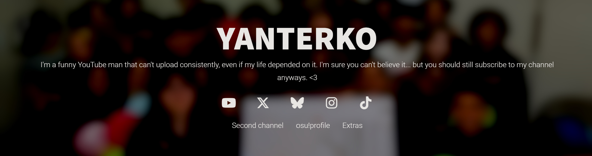

  <ul align="center" style="list-style: none;">
    
    

      <h1>YANTERSITE</h1>
     
    My personal website with my socials and other cool stuff that I like to keep there.
     
    <h3><a href="https://yanterko.k.vu">https://yanterko.k.vu</a></h3>
     
    

    
  </ul>

<h1>TODO</h1>
- randomized page background perhaps??

<h1>Credits</h1>
Site templates: <a href="https://html5up.net/">HTML5 Up</a>, <a href="https://github.com/kevquirk/simple.css">simple.css by Kev Quirk</a>
 
Fonts by <a href="https://fontawesome.com/">Font Awesome</a>
